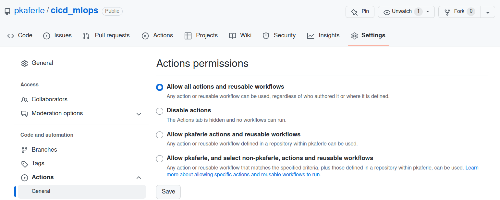
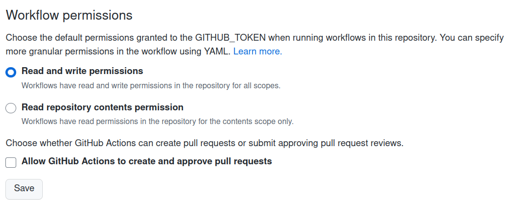

## Automation

### 1. Automate model testing

**Objectives:**

- Learn how to automate testing with Git and [CML](https://cml.dev/).
- Understand the processes that run after the Git Action workflow is triggered.

**Dependency:**

- script: `wine_linear_regression_test.py`

**Permissions:**

Make sue that the GitHub Actions have the permission to write in your repo, otherwise you will end up with an error.
- Click on the `Settings` button on the right-hand side in your repo
- Go to the menu on the left, click on the `Actions` and then on `General`.



- Go to the botom of the page and give `Read and write permission` to the workflow 




**Instructions:**

In previous lab we did all of our tests manually:

- tested data manually
- selected the best model manually
- installed all required libraries manually

This is:

- slow
- not standardized (everybody can alter the test code before running it on his computer)

Now, let's automate it:

1. Open the script and inspect which libraries we need for the code to run.
2. Create a file `requirements.txt` with the libraries that we need for the notebook to run:

```
pandas
scikit-learn
numpy
```

3. Sign in to your GitHub account
4. Create a new repo: `cicd`
5. Manually upload `requirements.txt` and `wine_linear_regression_test.py`
6. Make new config file: `cicd/.github/workflows/model_evaluation.yaml` and copy inside the following text:

```
name: model-training
on: [push]
jobs:
  run:
    runs-on: [ubuntu-latest]
    steps:
      - uses: actions/checkout@v2
      - uses: iterative/setup-cml@v1
      - name: Train model
        env:
          REPO_TOKEN: ${{ secrets.GITHUB_TOKEN }}
        run: |
```

7. You can commit it on the separate branch and create pull request, or on the main branch (no pull request needed).
8. Click on `Actions`, then on the name of the running job and finally on `run`. Inspect what's happening.
9. Add to your config file after `run` the following lines (line-by-line, be careful about the indentation). What happens with the metrics.txt, can you access it?

```
        run: |
          pip install -r requirements.txt
          python wine_linear_regression_test.py
          cat metrics.txt
```

10. Create a report by adding the following:

```
          cat metrics.txt >> report.md
          cml-send-comment report.md
```

### 4.2 Automate model performance comparison

What if we want to compare the performances of two different models? Is the one that we are developing better than the one on the master branch (current best one)?

To do it automatically, we can leverage DVC pipelines. If you are interested, read:

- introduction to [DVC pipelines](https://dvc.org/doc/start/data-pipelines)
- video [Machine Learning Pipelines with DVC](https://www.youtube.com/watch?v=71IGzyH95UY)
